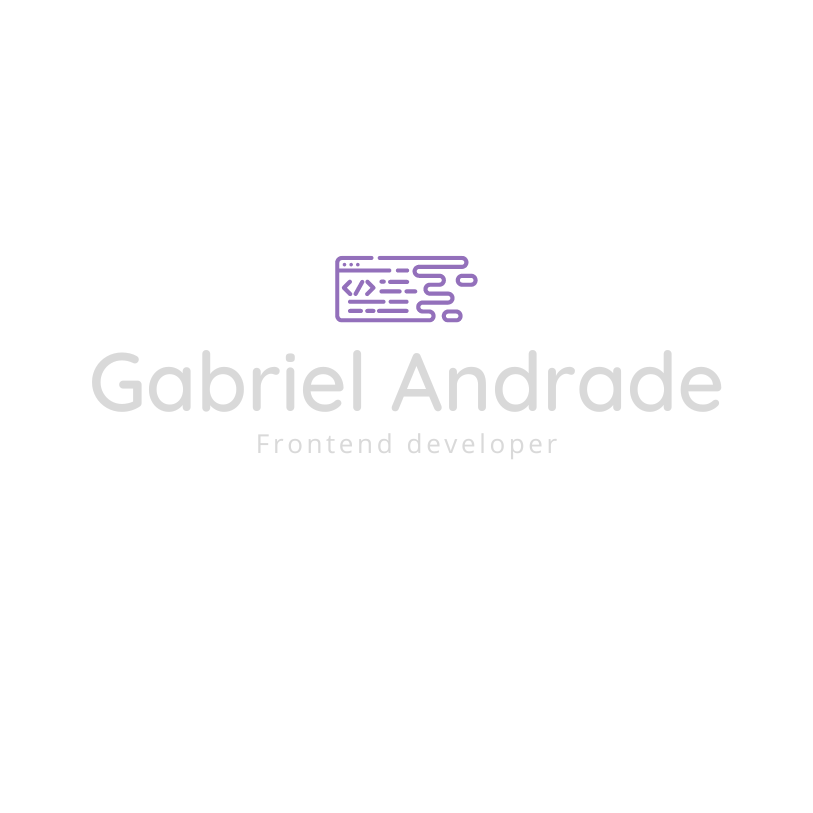
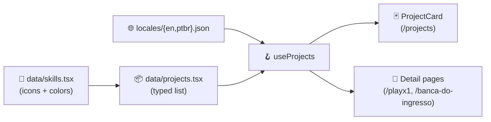

<div align="center">


<a href="https://gabrielandrade.net">
  
</a>

<br /><br />

<p>
  
  
  
  
  
  
</p>

<p>
  <a href="https://gabrielandrade.net">
    
  </a>
  &nbsp;
  <a href="https://github.com/gaabscps/gabs-portifolio/issues">
    
  </a>
  &nbsp;
  <a href="https://github.com/gaabscps/gabs-portifolio/commits/master">
    
  </a>
</p>

</div>

---

## ✨ About

A personal portfolio that doubles as a small, honest showcase of how I like to build front-ends — typed data, clean data flow, internationalization, and graceful empty states.

- **Typed project data** — every project lives in `src/data/projects.tsx` with a strict `Project` type, fully separated from UI.
- **Shared skill catalog** — icons and colors live in `src/data/skills.tsx`; projects reference skills by key, so React's icon is defined exactly once.
- **Internationalization** — BR ↔ EN via a `LanguageProvider`, with JSON dictionaries in `src/locales/`.
- **Empty states everywhere** — every remote image has a Chakra `fallback`, so a broken link never looks broken.
- **Static everything** — every page prerenders at build time. No server runtime cost.

## 🎨 Preview

<p align="center">
  
</p>

> 📸 Live: **[gabrielandrade.net](https://gabrielandrade.net)** — full screenshots will land here once the latest commits (image fallbacks + Next 15.5) are deployed.

## 🛠️ Tech stack

| Layer | Tool |
|---|---|
| Framework | **Next.js 15.5** — App Router, every route is static |
| Language | **TypeScript** with strict mode |
| UI library | **Chakra UI v2** |
| Animations | **Framer Motion 11** |
| Icons | **react-icons** |
| Hosting | **Vercel** |
| Quality | **Dependabot** · `audit-ci` · ESLint · `tsc --noEmit` |

## 🗂️ Project structure

```
src/
├── app/                # App Router pages — one folder per route
│   ├── about/
│   ├── banca-do-ingresso/
│   ├── contact/
│   ├── playx1/
│   └── projects/
├── components/         # Shared UI (Card, Navbar, ProjectPlaceholder, ...)
├── context/            # LanguageProvider
├── data/               # Typed project list + skill catalog
├── hooks/              # useProjects, useWindows, useFullSize
├── locales/            # en.json, ptbr.json
├── themes/             # Chakra theme + fonts
└── types/              # Project, Skill
```

### Data flow



`useProjects` is the only consumer of the data file — it merges the typed `Project` entries with the translations and exposes a ready-to-render view to every page.

## 🚀 Run locally

```bash
yarn install
yarn dev                  # http://localhost:3000
yarn build && yarn start  # production server
yarn lint                 # ESLint
```

No environment variables required.

## ➕ Add a new project

1. **Add the entry** to `src/data/projects.tsx`:
   ```ts
   {
     id: "new-project",
     slug: "new-project",
     translationKey: "newProject",
     year: "2026",
     coverImage: "https://.../cover.png",
     images: ["https://.../1.png", "https://.../2.png"],
     skills: [skills.react, skills.typescript],
     links: { route: "/new-project", live: "...", github: "..." },
     status: "live",
   }
   ```
2. **Add translations** for `newProject.title` and `newProject.description` in `src/locales/en.json` and `src/locales/ptbr.json`.
3. *(Optional)* Create a custom detail page at `src/app/new-project/page.tsx`.

The `Project` type in `src/types/project.ts` is the source of truth — TypeScript will catch any missing field.

## 🤖 Quality & automation

| Check | How |
|---|---|
| Dependency updates | Dependabot with a 5-day cooldown; ignores major bumps that need manual migration |
| Security audit | `audit-ci` in CI — blocks PRs on `moderate+` advisories |
| Type checking | `tsc --noEmit` (no `any` in the codebase) |
| Lint | ESLint (`eslint-config-next`) |
| Build | Every page prerenders as `○ (Static)` |

## 🗺️ Roadmap

| ✅ Shipped | ⬜ Open |
|---|---|
| Upgrade to **Next.js 15.5** (#22) | Convert pages to **Server Components** (#14) |
| Typed **project data** (#13) | **End-to-end tests** with Playwright (#16) |
| Image **empty states** & fallbacks (#12) |  |
| **Dependabot** + audit CI (#20) |  |

## 🔎 SEO setup

The site ships with the SEO floor in code (per-route metadata, sitemap, robots, JSON-LD, OG image, semantic headings). To make the site actually appear in Google, you still need to register the domain with **Google Search Console** and submit the sitemap. The steps below are a one-time setup.

### 1. Verify ownership in Google Search Console

Open [search.google.com/search-console](https://search.google.com/search-console) and add a new property using **Domain** (preferred over URL prefix — it covers `https://`, `https://www.`, and subdomains in one go).

You get two verification options. Pick **one**:

**Option A — DNS TXT record (preferred).** GSC shows you a token like `google-site-verification=abc123...`. Add it as a TXT record on the root of `gabrielandrade.net` in your DNS provider:

| Host | Type | Value |
|---|---|---|
| `@` | `TXT` | `google-site-verification=<token-from-GSC>` |

Wait 5–60 minutes for propagation, then click **Verify** in GSC.

**Option B — HTML file (fallback).** GSC offers a file named `google<hash>.html`. Download it, place it under `public/`, commit, deploy. The file becomes available at `https://gabrielandrade.net/google<hash>.html`. Click **Verify** in GSC.

### 2. Submit the sitemap

In GSC: **Sitemaps → Add a new sitemap**, enter:

```
https://gabrielandrade.net/sitemap.xml
```

Status should turn to **Success** within minutes. The sitemap is generated at build time by `src/app/sitemap.ts`; new routes appear automatically on the next deploy.

### 3. Monitor indexing

| Where | What to look for |
|---|---|
| **Pages** (left sidebar) | "Indexed" count over time. Expect 0 on day 1, full count after a few weeks. |
| **Pages → Not indexed** | Lists pages Google found but did not index, with a reason per page. |
| **URL Inspection** (top bar) | Paste any URL to see its indexing status and request an index re-check. |

Common errors and what they mean (in plain English):

- **"Discovered — currently not indexed"** — Google knows the URL exists but has not crawled it yet. Patience usually fixes it (days to weeks for a new domain).
- **"Crawled — currently not indexed"** — Google crawled the page but decided not to index it. Usually a sign the page is too thin / too similar to another. Add more content or merge with a stronger page.
- **"Soft 404"** — Google thinks the page is empty even though it returned 200. Check for missing `<h1>` or near-empty body.
- **"Page with redirect"** — informational; the URL redirects to another (e.g., `www.` to non-`www.`). Safe to ignore if intentional.

A brand-new domain typically takes **2–8 weeks** to fully index. The single biggest accelerator is inbound links (your LinkedIn / GitHub README / Dev.to profile linking to `gabrielandrade.net`).

## 📬 Get in touch

<p>
  <a href="https://github.com/gaabscps">
    
  </a>
  &nbsp;
  <a href="https://www.linkedin.com/in/gabriel-andrade-199601a2/">
    
  </a>
  &nbsp;
  <a href="mailto:gaabscps@gmail.com">
    
  </a>
  &nbsp;
  <a href="https://wa.me/5519999388761">
    
  </a>
</p>

<div align="center">

<sub>Built with care · <a href="https://gabrielandrade.net">gabrielandrade.net</a></sub>

</div>
